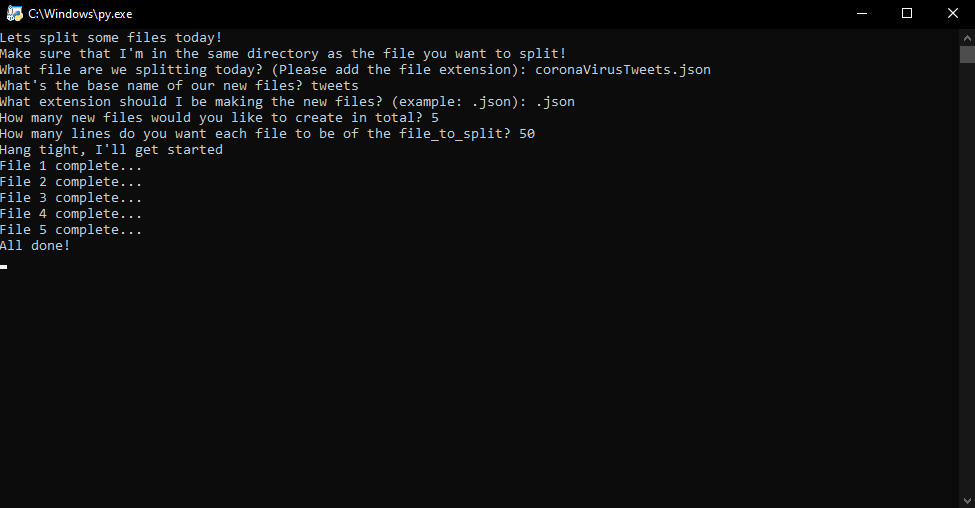
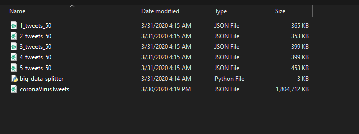
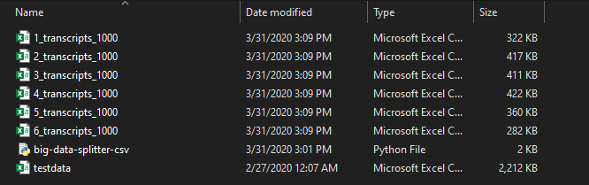

# Welcome to the home of the big-data-splitter

As we go on our journey of programming, data science, data engineering, and many other lovely things we are sometimes faced with HUGE data!

Do you have a JSON file that is 166 GB and want to break it down into smaller more manageable JSON files? (Thats literally the inspiration behind me!)

I can also tackle other problems too!

## Requirement
I only have one request...You have to put the `big-data-splitter.py` in the same directory as your HUGE data file (A sacrifice we have to make). 

You can literally copy and paste me! 

Just make sure that I'm the newest version.

## Examples

### JSON
Here are some example code answers to the questions I'm going to ask!
```
What file are we splitting today? (Please add the file extension): HUGE-data.json

What's the base name of our new files? tweets

How many new files would you like to create in total? 5

How many lines do you want each file to be of the file_to_split? 50
```

Don't worry, I'll update you on my progress as we tackle this problem together. 
This is what that'll look like:




Heres an example of what your new JSON files look like!



### CSV
Here are some example code answers to the questions I'm going to ask!
```
What file are we splitting today? (Please add the file extension): HUGE-data.csv

What's the base name of our new files? transcripts

How many lines do you want each file to be of the file_to_split? 500
```

* The `big-data-splitter-csv.py` splits the entire file (no matter the size) into equal parts. This is not like the json counterpart.

Heres an example of what your new CSV files look like!




Happy big-data-splitting!
